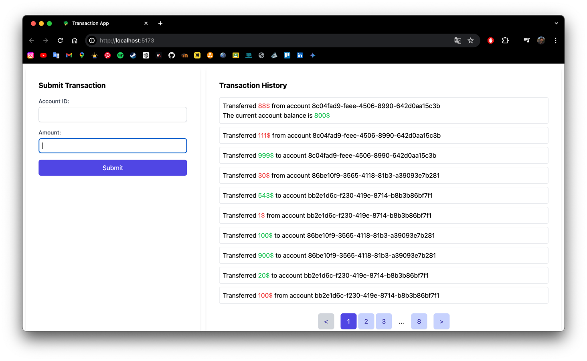

## Transaction Management System

This is my personal readme for the Transaction Management System I built. It details the languages and technologies used, what the system allows users to do, and the valuable lessons I learned along the way.

**Building the System:**

* **TypeScript**: This became my go-to language for writing the backend services and defining the application's logic.
* **SQL**: I used SQL within the Prisma schema file to design the database structure and how different entities relate to each other.
* **Package Managers**: Yarn was my primary choice.
* **JavaScript & Vue**: JavaScript worked together with Vue to bring the user interface to life on the frontend.
* **Prisma**: This powerful ORM (Object-Relational Mapper) helped me interact seamlessly with the PostgreSQL database using TypeScript.
* **Docker & Docker Compose**: Containerization became a key part of the project. Docker helped containerize the application, while Docker Compose ensured smooth management of multiple services working together.

**Lessons Learned:**

Building this system was a fantastic learning experience! Here are some of the key takeaways:

* **Prisma:** I mastered using Prisma with TypeScript to effectively interact with the PostgreSQL database.
* **Containerization:** Docker and Docker Compose became my tools for containerizing the application and managing its various services efficiently.
* **REST API Pagination:** I implemented pagination within the REST API, allowing users to retrieve information in manageable chunks.
* **Vue:** I gained valuable experience using Vue for building user-friendly interfaces on the frontend.

**Getting Started:**

Excited to try it out? Here's how to get it up and running:

1. Grab a copy of the codebase by cloning the repository.
2. Install all the necessary dependencies using `yarn install`.
3. Fire up the services with `docker-compose up`.

**Using the System:**

The system offers several functionalities:

- **Create Account**: The system allows for the creation of new accounts. Each account is uniquely identified by an ID.
- **Create Transaction**: The system allows for the creation of transactions. Each transaction is associated with an account and has an amount and a timestamp.
- **Get Transactions**: The system provides the functionality to retrieve all transactions in descending order of their creation time.
- **Get Paginated Transactions**: The system supports pagination in transaction retrieval. This allows for efficient retrieval of transactions in manageable chunks.
- **Get Account Balance**: The system can calculate the balance of an account by summing up the amounts of all transactions associated with the account.

**Additional Notes:**

Before starting the services, make sure you have Docker installed and running on your system. Additionally, remember to set the `DATABASE_URL` environment variable in the `.env` file for proper database connection.

